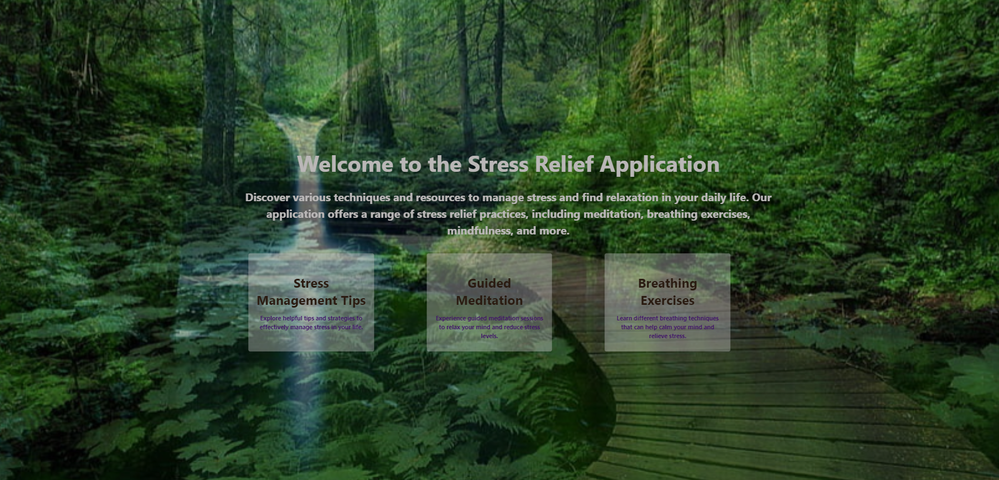

<!-- Description, Table of Contents, Installation, Usage, License, credits, Contributing, Tests, and Questions -->

# Zenify
===================================================
## Description
 Introducing Zenify, the ultimate stress relief app designed to help you find tranquility in the midst of a hectic world. With Zenify, you can access a wide range of meditation and mindfulness exercises tailored to your specific needs. Whether you’re looking to improve sleep or reduce stress Zenify is there for you! Go ahead give it a [try](https://whispering-sea-09039-50a149ea49a2.herokuapp.com/)!
***
## Table of contents
- [Technologies](#technologies)
- [Installation](#installation) 
- [License](#license)
- [Credits](#credits)
<!-- - [Contributions](#contributions) -->
- [Testing](#testing)
- [Questions](#questions)
***
## Technologies
***
-MERN
-Bcrypt
-GraphQL
-Apollo-server

## Installation
Run npm i to install dependencies, run npm run develop to see the app in action.
***

## License

Using MIT license for this project.
***
## Credits
- Georgia Tech Coding Bootcamp
- Christopher Bailey
- John Metzger
- Corbin Spence
- Jacob Sniff
- Gabriela Recinos
- CJ as our TA
- 
- 
- 
- 

***

### Testing

Check this link: 

<!-- ### Questions
<!--  -->
If you have any questions about the project please send an email to any of the team members:
- Gabriela: mgabriela.recinos@gmail.com
- John: jsmetzger9@gmail.com
- Christopher: christopherbailey089@gmail.com
- Jacob: jacobsniff18@gmail.com
- Corbin: corbinspence16@gmail.com
- 

*** -->

